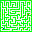
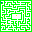

# LD57 - The Minotaur's Maze
This is the project for LD57 "Jam" by Meiyan Chen and Max Kämmerer.

Playable versions embedded here

[Github Pages](https://maxkaemmerer.github.io/ld57/)

[Ludum Dare](https://ldjam.com/events/ludum-dare/57/the-minotaurs-maze)

[itch.io](https://kaumlaut.itch.io/minotaurs-maze)

This is the frist game we made from scratch, without following a course or tutorials. It is also our first game jam.

We first intended to use the theme and while the theme was not announced yet we actually came up with an idea that incorporated all themes from the final round of voting. But that game would have ultimately been way too big and after the theme was chosen we ended up thinking up another idea. We had trouble finding an idea that matches the chosen theme of "Depths" while also not being a game that has been done before many times. So we ultimately ended up picking 2 of the other theme finalists in "Keep it together" and "Companion". Pretty early on we decided this was going to be a local coop game, which sounded like a cool challenge and actually ended up being very simple. 

We thought about making a sort of puzzle game where both players hold the end of a rope and need to get together while untangling the rope, which would be wrapped around all kinds of obstacles, but that sounded like a physics nightmare so we decided gainst it and came up with the idea of 2 players finding each other inside of a maze while being hunted by one or multiple Minotaurs. This seemed like a doable concept so we got started.

Mei got to work on music and sound effects while Max started working on the basic sprites, that were intended to be placeholders but ended up staying. Then we worked on player movement, setting up multiple viewports and controlling 2 characters at the same time. We built a basic debug level to test collision and visuals, worked on web exports and automated publishing to Github Pages.

Then we started working on the first iteration of the Minotaur, or bull like it is called in the game files. Player detection was not a big problem, we essentially made the Minotaur walk to the location it last saw a player and then had it look around to search for the player again. We also liked the idea of a charge attack that would destroy walls and worked on that. Since the cameras are pretty zoomed in on purpose, so the player could not see the whole map, we wanted the player to able to call out to each other, creating a particle effect that would reveal their general location. We were hoping to have the Minotaur react to this calling out and chase the player down but has issues with pathfinding and ai. We ended up with fairly dumb Minotaurs, early they would essentially get glued to walls but we ended up detecting whether or not there was an open path in each direction the minotair could go to. Which direction they would choose is still random however, with a bit of help, preventing the Minotaur from just walking left and right the whole time.

Building the levels in engine by placing the scenes hand by hand would have been a pain, so we decided to build a simple level editor. The basic idea was to draw an image in a format as big the level was supposed to be. So if the map was supposed to be 32x32 tiles, we would create a png with 32x32 pixels. We used different colors to represent certain scenes. Green would be the hedges/walls, red and blue the players and yellow the Minotaur. We parsed the image in Godot and programmatically instantiated all the scenes and attached them to the world.

This made it very easy to create new maps and was just a very enjoyable exercise.

Here and there throughout the process we added all the sound effects and music. We wanted the basic background music to play the whole time and layer additional instruments over it when the player got close to a Minotaur. We ended up sticking the overlayed music on to the Minotaur Scene itself so we could just use Godots Distance feature for the AudioStreamplayer2D instead of handling that logik ourselves. We are initially planning to handle all the music in a central scene but this ended up being just a bit too convenient.

<audio controls src="./sound/Background_1.mp3"></audio>

<audio controls src="./sound/Monster_1.mp3"></audio>

<audio controls src="./sound/Excitement_1.mp3"></audio>

We wanted the player to be worried about what they saw around each corner, which informed both the music and lighting. The lighting was a bit of an issue and did not end up the way we wanted it, but it still ended up kind of interesting.

We finished up by adding very simple animations and cleaning up the Minotair path finding a bit. After we playtested it was a bit to easy so we added more Minotaurs.

## Takeaways
- The whole game jam experience was very fun. Quick iteration and the impossibility of perfection helped get something done in a very short amount of time.
- We are actually pretty happy with the result, considering this is our first real attempy.
- The Leveleditor ended up working extremely well and was especially fun to build.
- Before building another game we would like to look at how to do pathfinding and ai properly.
- Godot is awesome. Quick build times, reasonable structures and methods to build a game, easy to collaborate via Git.
- Sketching out the basic idea on a whiteboard is really fun.
- Lighting is a topic we need to look at and learn about

Max' Favorite part of the Project: Building the Leveleditor, figuring out the basic idea on the whiteboard(Leonardo board)

Meis Favorite part of the Project: Coming up with ideas, working with Godot and writing music for it

## Tools

- Game Engine: Godot
- Project Management / Ideating: Milanote, Leonardo
- Music Production: Logic Pro
- Sound Effects: Logic Pro, Bfxr, Audacity
- Pixel Art and Animation: Aseprite, Piskel

## Sources
Step Sounds:
- Monster :https://pixabay.com/sound-effects/monster-footsteps-on-gravel-295850/
- Player:  https://pixabay.com/sound-effects/footsteps-dirt-gravel-6823/

Fonts: 
- Jersey 15 by Sarah Cadigan-Fried
- Jacquard 12 by Sarah Cadigan-Fried
